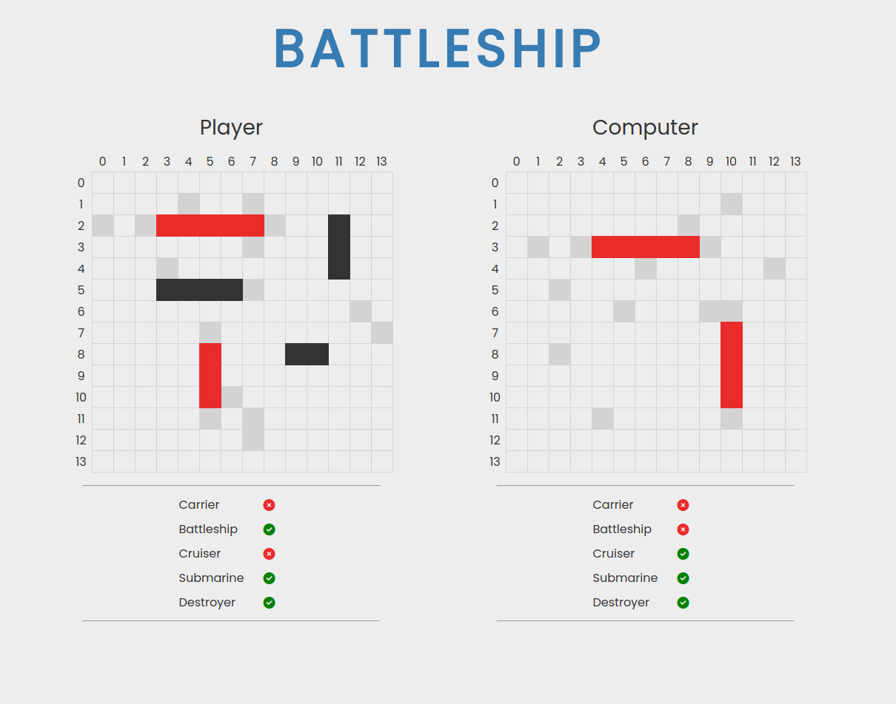

# Battleship
Implementation of the classic Battleship game with the purpose of using Test Driven Development. Project from The Odin Project [curriculum](https://www.theodinproject.com/).

 

## Features

- Test Driven Development using Jest
- Linting using Eslint
- Finite State Machine pseudo implementation using if/else for Computer AI

## Built With

- Vanilla JS
- HTML5
- CSS3

## Live Demo

[Battleship](http://gavinslim.com/battleship/) :ship:

## Setup

1. Clone the repository:<br>```git clone https://github.com/gavinslim/battleship.git```

2. Inside the cloned repo, install the required dependencies:<br>```npm install```

3. Initiate live demo:<br>```npm run start```

4. Produce the distribution files:<br>```npm run build```

5. Run Jest test:<br>```npm run test-watch```

